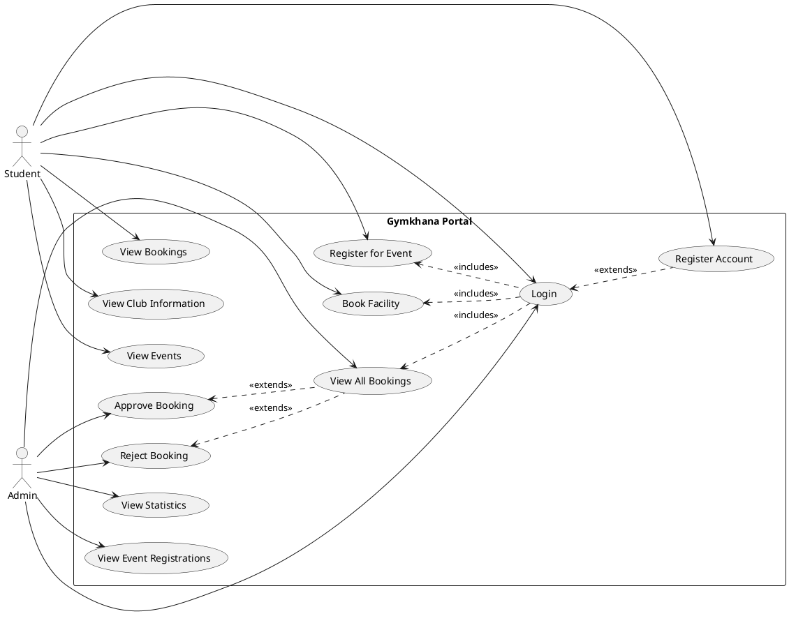
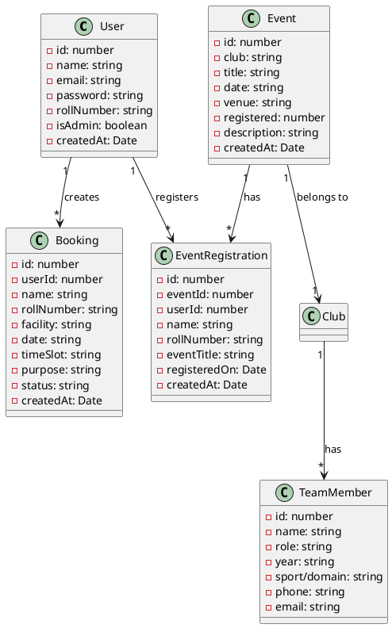
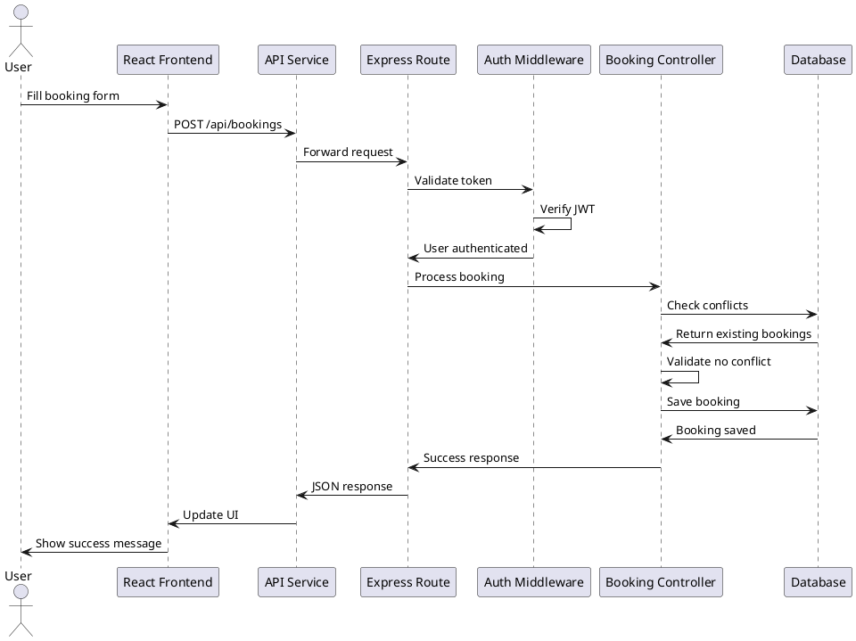
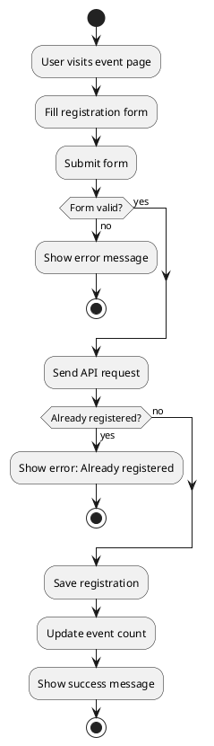
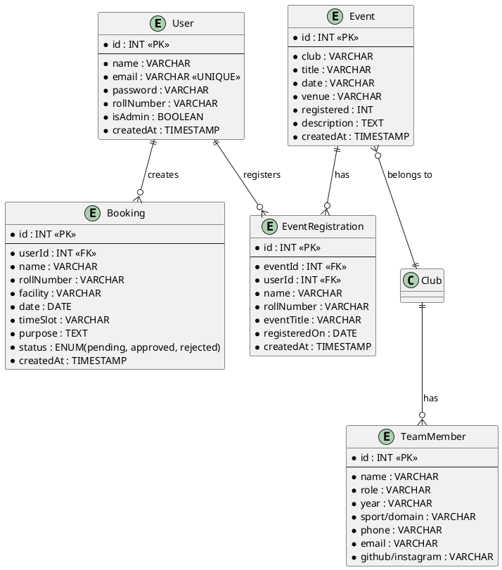

# IIIT Gymkhana Portal - Complete Documentation

## Table of Contents
1. [Project Overview](#1-project-overview)
2. [Problem Statement and Objectives](#2-problem-statement-and-objectives)
3. [System Requirements](#3-system-requirements)
4. [Architecture](#4-architecture)
5. [UML Diagrams](#5-uml-diagrams)
6. [Modules/Components Description](#6-modulescomponents-description)
7. [Database Design](#7-database-design)
8. [Algorithms and Workflows](#8-algorithms-and-workflows)
9. [Technologies Used](#9-technologies-used)
10. [Testing Details](#10-testing-details)
11. [Future Improvements](#11-future-improvements)
12. [Conclusion](#12-conclusion)

---

## 1. Project Overview

The **IIIT Gymkhana Portal** is a comprehensive full-stack web application designed to streamline and digitize the management of student activities, facility bookings, and event registrations for the Gymkhana (student union) at IIIT. The system provides a centralized platform where students can book facilities, register for events, and administrators can manage bookings and view statistics.

### Key Highlights:
- **Type**: Full-stack web application
- **Architecture**: RESTful API with React frontend
- **Database**: JSON file-based (easily migratable to MongoDB/PostgreSQL)
- **Authentication**: JWT-based secure authentication
- **Deployment**: Development-ready, production-configurable

---

## 2. Problem Statement and Objectives

### Problem Statement

Traditional Gymkhana management systems rely heavily on manual processes, paper-based forms, and in-person coordination. This leads to:

- **Inefficiency**: Time-consuming manual booking and approval processes
- **Lack of Transparency**: Students cannot track their booking status easily
- **Poor Resource Management**: No centralized view of facility availability
- **Limited Accessibility**: Students must be physically present to book facilities
- **Event Management Challenges**: Difficult to track event registrations and participation
- **Administrative Overhead**: Admins struggle to manage multiple requests efficiently

### Objectives

1. **Digitize Facility Booking**: Create an online system for booking sports grounds, auditoriums, seminar halls, and labs
2. **Streamline Event Management**: Enable easy event registration and tracking for Sports, Technical, and Cultural clubs
3. **Improve Administrative Efficiency**: Provide admins with a dashboard to approve/reject bookings and view statistics
4. **Enhance User Experience**: Create an intuitive, responsive interface accessible from any device
5. **Ensure Security**: Implement secure authentication and authorization mechanisms
6. **Provide Real-time Updates**: Show live booking status and event registration counts

---

## 3. System Requirements

### 3.1 Functional Requirements

#### User Management
- **FR1**: Users can register with name, email, password, and roll number
- **FR2**: Users can login with email and password
- **FR3**: System authenticates users using JWT tokens
- **FR4**: Users can view their profile information
- **FR5**: Admin users have elevated privileges

#### Facility Booking
- **FR6**: Authenticated users can submit booking requests for facilities
- **FR7**: Users must provide facility name, date, time slot, and purpose
- **FR8**: System checks for booking conflicts (same facility, date, time)
- **FR9**: Users can view their booking history
- **FR10**: Admins can approve or reject booking requests
- **FR11**: System prevents double-booking of approved slots

#### Event Management
- **FR12**: Users can view events by club (Sports, Technical, Cultural)
- **FR13**: Users can view detailed event information
- **FR14**: Users can register for events with name and roll number
- **FR15**: System tracks event registration counts
- **FR16**: System prevents duplicate registrations

#### Club Information
- **FR17**: Users can view club pages (Sports, Technical, Cultural)
- **FR18**: Users can view team members for each club
- **FR19**: Users can view upcoming events for each club

#### Admin Functions
- **FR20**: Admins can view all booking requests
- **FR21**: Admins can approve or reject bookings
- **FR22**: Admins can view dashboard statistics
- **FR23**: Admins can view event registrations

### 3.2 Non-Functional Requirements

#### Performance
- **NFR1**: API response time should be < 500ms for most requests
- **NFR2**: Page load time should be < 2 seconds
- **NFR3**: System should handle at least 100 concurrent users

#### Security
- **NFR4**: Passwords must be hashed using bcrypt
- **NFR5**: JWT tokens must expire after 7 days
- **NFR6**: API endpoints must validate authentication tokens
- **NFR7**: CORS must be properly configured

#### Usability
- **NFR8**: Interface must be responsive (mobile, tablet, desktop)
- **NFR9**: Error messages must be clear and user-friendly
- **NFR10**: Navigation must be intuitive

#### Reliability
- **NFR11**: System should have 99% uptime
- **NFR12**: Data must be persisted reliably
- **NFR13**: System should handle errors gracefully

#### Scalability
- **NFR14**: Database should be easily migratable to MongoDB/PostgreSQL
- **NFR15**: Code should be modular and maintainable

---

## 4. Architecture

### 4.1 System Architecture

The system follows a **3-tier architecture**:

```
┌─────────────────────────────────────────────────────────┐
│                    Presentation Layer                    │
│              (React Frontend - Port 5173)                │
│  ┌──────────┐  ┌──────────┐  ┌──────────┐              │
│  │  Pages   │  │Components│  │ Services │              │
│  └──────────┘  └──────────┘  └──────────┘              │
└──────────────────────┬──────────────────────────────────┘
                       │ HTTP/REST API
                       │ (JSON)
┌──────────────────────▼──────────────────────────────────┐
│                   Application Layer                      │
│            (Express Backend - Port 5001)                 │
│  ┌──────────┐  ┌──────────┐  ┌──────────┐              │
│  │  Routes  │  │Middleware│  │   Auth   │              │
│  └──────────┘  └──────────┘  └──────────┘              │
└──────────────────────┬──────────────────────────────────┘
                       │
┌──────────────────────▼──────────────────────────────────┐
│                      Data Layer                          │
│              (JSON File Database)                        │
│  ┌──────────────────────────────────────┐               │
│  │  database.json (Users, Bookings,     │               │
│  │  Events, Registrations, Team Members)│               │
│  └──────────────────────────────────────┘               │
└──────────────────────────────────────────────────────────┘
```

### 4.2 Technology Stack

**Frontend:**
- React 19.2.0 (UI Framework)
- TypeScript (Type Safety)
- React Router 7.9.6 (Routing)
- Tailwind CSS 4.1.17 (Styling)
- Vite 7.2.4 (Build Tool)
- Lucide React (Icons)

**Backend:**
- Node.js (Runtime)
- Express 4.18.2 (Web Framework)
- JWT (Authentication)
- bcryptjs 2.4.3 (Password Hashing)
- CORS 2.8.5 (Cross-Origin Resource Sharing)

**Database:**
- JSON file-based storage (Development)
- Easily migratable to MongoDB/PostgreSQL

### 4.3 Request Flow

```
User Action → React Component → API Service → Express Route → 
Middleware (Auth) → Business Logic → Database → Response → 
Frontend Update
```

---

## 5. UML Diagrams

### 5.1 Use Case Diagram



### 5.2 Class Diagram



### 5.3 Sequence Diagram - Booking Flow



### 5.4 Activity Diagram - Event Registration



---

## 6. Modules/Components Description

### 6.1 Frontend Modules

#### 6.1.1 Pages Module

**Location**: `frontend/src/pages/`

1. **Home Page** (`App.tsx`)
   - Landing page with hero section
   - Club navigation cards
   - Responsive design

2. **Login Page** (`login.tsx`)
   - User authentication form
   - Registration option
   - Form validation
   - Error handling

3. **Booking Page** (`booking.tsx`)
   - Facility booking form
   - Date and time slot selection
   - Auto-fill for logged-in users
   - Submission handling

4. **Admin Panel** (`admin.tsx`)
   - Dashboard with statistics
   - Booking management interface
   - Approve/reject functionality
   - Event registration viewer

5. **Event Details** (`event-details.tsx`)
   - Event information display
   - Registration form
   - Success/error handling
   - Club-specific styling

6. **Club Pages** (`clubs/`)
   - Sports Club (`sports.tsx`)
   - Technical Club (`technical.tsx`)
   - Cultural Club (`cultural.tsx`)
   - Each displays events and team members

7. **About Page** (`about.tsx`)
   - Mission and vision
   - Statistics display
   - College information

#### 6.1.2 Components Module

**Location**: `frontend/src/components/`

1. **Navbar** (`navbar.tsx`)
   - Navigation menu
   - User authentication state
   - Profile dropdown
   - Mobile responsive menu
   - Logout functionality

#### 6.1.3 Services Module

**Location**: `frontend/src/services/`

1. **API Service** (`api.ts`)
   - Centralized API communication
   - Token management
   - Error handling
   - Request/response interceptors
   - Methods for:
     - Authentication (login, register, logout)
     - Bookings (create, get, getById)
     - Events (getAll, getById, register)
     - Clubs (getAll, getTeam)
     - Admin (stats, bookings, approve, reject, registrations)

### 6.2 Backend Modules

#### 6.2.1 Routes Module

**Location**: `backend/routes/`

1. **Auth Routes** (`auth.js`)
   - `POST /api/auth/register` - User registration
   - `POST /api/auth/login` - User login
   - `GET /api/auth/me` - Get current user

2. **Booking Routes** (`bookings.js`)
   - `GET /api/bookings` - Get user's bookings (or all for admin)
   - `POST /api/bookings` - Create booking request
   - `GET /api/bookings/:id` - Get booking by ID

3. **Event Routes** (`events.js`)
   - `GET /api/events` - Get all events (optional club filter)
   - `GET /api/events/:id` - Get event by ID
   - `POST /api/events/:id/register` - Register for event

4. **Club Routes** (`clubs.js`)
   - `GET /api/clubs` - Get all clubs info
   - `GET /api/clubs/:club/team` - Get team members for club

5. **Admin Routes** (`admin.js`)
   - `GET /api/admin/stats` - Get dashboard statistics
   - `GET /api/admin/bookings` - Get all bookings
   - `PATCH /api/admin/bookings/:id/approve` - Approve booking
   - `PATCH /api/admin/bookings/:id/reject` - Reject booking
   - `GET /api/admin/registrations` - Get event registrations

#### 6.2.2 Middleware Module

**Location**: `backend/middleware/`

1. **Auth Middleware** (`auth.js`)
   - `authenticateToken` - Validates JWT tokens
   - `requireAdmin` - Ensures admin privileges
   - Error handling for expired/invalid tokens

#### 6.2.3 Data Module

**Location**: `backend/data/`

1. **Database Module** (`database.js`)
   - `readDB()` - Read from JSON file
   - `writeDB()` - Write to JSON file
   - Database initialization with default data
   - Data structure management

---

## 7. Database Design

### 7.1 Entity Relationship Diagram



### 7.2 Database Schema

#### Users Table
| Field | Type | Constraints | Description |
|-------|------|-------------|-------------|
| id | Integer | Primary Key, Auto-increment | Unique user identifier |
| name | String | Required | User's full name |
| email | String | Required, Unique | User's email address |
| password | String | Required, Hashed | Bcrypt hashed password |
| rollNumber | String | Required | Student roll number |
| isAdmin | Boolean | Default: false | Admin privilege flag |
| createdAt | Timestamp | Auto-generated | Account creation time |

#### Bookings Table
| Field | Type | Constraints | Description |
|-------|------|-------------|-------------|
| id | Integer | Primary Key, Auto-increment | Unique booking identifier |
| userId | Integer | Foreign Key → Users.id | User who created booking |
| name | String | Required | Requester's name |
| rollNumber | String | Required | Requester's roll number |
| facility | String | Required | Facility name |
| date | Date | Required | Booking date |
| timeSlot | String | Required | Time slot (e.g., "2:00 PM - 5:00 PM") |
| purpose | Text | Required | Purpose of booking |
| status | Enum | Default: "pending" | pending/approved/rejected |
| createdAt | Timestamp | Auto-generated | Request creation time |

#### Events Table
| Field | Type | Constraints | Description |
|-------|------|-------------|-------------|
| id | Integer | Primary Key, Auto-increment | Unique event identifier |
| club | String | Required | Club name (sports/technical/cultural) |
| title | String | Required | Event title |
| date | String | Required | Event date |
| venue | String | Required | Event venue |
| registered | Integer | Default: 0 | Registration count |
| description | Text | Optional | Event description |
| createdAt | Timestamp | Auto-generated | Event creation time |

#### Event Registrations Table
| Field | Type | Constraints | Description |
|-------|------|-------------|-------------|
| id | Integer | Primary Key, Auto-increment | Unique registration identifier |
| eventId | Integer | Foreign Key → Events.id | Event being registered for |
| userId | Integer | Foreign Key → Users.id (nullable) | User ID if authenticated |
| name | String | Required | Registrant's name |
| rollNumber | String | Required | Registrant's roll number |
| eventTitle | String | Required | Event title (denormalized) |
| registeredOn | Date | Auto-generated | Registration date |
| createdAt | Timestamp | Auto-generated | Registration creation time |

#### Team Members (Embedded in Clubs)
| Field | Type | Constraints | Description |
|-------|------|-------------|-------------|
| id | Integer | Primary Key | Unique member identifier |
| name | String | Required | Member's name |
| role | String | Required | Position/role |
| year | String | Required | Academic year |
| sport/domain | String | Required | Sport or technical domain |
| phone | String | Required | Contact number |
| email | String | Required | Email address |
| github/instagram | String | Optional | Social media handle |

### 7.3 Database Relationships

1. **User → Bookings**: One-to-Many
   - One user can create multiple bookings
   - Each booking belongs to one user

2. **User → Event Registrations**: One-to-Many
   - One user can register for multiple events
   - Each registration belongs to one user (optional)

3. **Event → Event Registrations**: One-to-Many
   - One event can have multiple registrations
   - Each registration is for one event

4. **Club → Events**: One-to-Many
   - One club can have multiple events
   - Each event belongs to one club

5. **Club → Team Members**: One-to-Many
   - One club has multiple team members
   - Each team member belongs to one club

---

## 8. Algorithms and Workflows

### 8.1 User Authentication Workflow

```
1. User submits login form (email, password)
2. Frontend sends POST request to /api/auth/login
3. Backend validates email exists
4. Backend compares password with bcrypt hash
5. If valid:
   a. Generate JWT token with user info
   b. Return token and user data
   c. Frontend stores token in localStorage
   d. Frontend updates UI state
6. If invalid:
   a. Return error message
   b. Frontend displays error
```

### 8.2 Facility Booking Workflow

```
1. User fills booking form
2. Frontend validates form data
3. Frontend sends POST /api/bookings with:
   - Authentication token
   - Booking details (facility, date, time, purpose)
4. Backend middleware validates token
5. Backend checks for conflicts:
   a. Query bookings with same facility, date, timeSlot
   b. Filter for status = "approved"
   c. If conflict exists → return error
6. If no conflict:
   a. Create new booking with status "pending"
   b. Save to database
   c. Return success response
7. Frontend displays success message
```

### 8.3 Booking Approval Workflow

```
1. Admin views booking requests
2. Admin clicks "Approve" or "Reject"
3. Frontend sends PATCH /api/admin/bookings/:id/approve or /reject
4. Backend validates admin token
5. Backend checks for conflicts (if approving):
   a. Query other approved bookings
   b. Check same facility, date, timeSlot
   c. If conflict → return error
6. If no conflict:
   a. Update booking status
   b. Save to database
   c. Return success
7. Frontend refreshes booking list
```

### 8.4 Event Registration Workflow

```
1. User views event details
2. User fills registration form (name, rollNumber)
3. Frontend sends POST /api/events/:id/register
4. Backend checks if already registered:
   a. Query registrations with eventId and rollNumber
   b. If exists → return error
5. If not registered:
   a. Create new registration
   b. Increment event.registered count
   c. Save to database
   d. Return success
6. Frontend shows success message
7. Frontend refreshes event data (updated count)
```

### 8.5 Conflict Detection Algorithm

```javascript
function checkBookingConflict(newBooking, existingBookings) {
  return existingBookings.some(booking => 
    booking.facility === newBooking.facility &&
    booking.date === newBooking.date &&
    booking.timeSlot === newBooking.timeSlot &&
    booking.status === 'approved'
  );
}
```

### 8.6 Token Validation Algorithm

```javascript
function validateToken(token) {
  1. Extract token from Authorization header
  2. If no token → return 401 error
  3. Verify token signature with JWT_SECRET
  4. Check token expiration
  5. If valid:
     - Decode user information
     - Attach to request object
     - Continue to next middleware
  6. If invalid:
     - Return 401/403 error with specific message
}
```

---

## 9. Technologies Used

### 9.1 Frontend Technologies

#### React 19.2.0
- **Why**: Industry-standard UI library with component-based architecture
- **Benefits**: Reusable components, virtual DOM, large ecosystem
- **Usage**: Building all UI components and pages

#### TypeScript
- **Why**: Type safety and better developer experience
- **Benefits**: Catch errors at compile time, better IDE support
- **Usage**: Type definitions for all components and services

#### React Router 7.9.6
- **Why**: Client-side routing for single-page application
- **Benefits**: No page reloads, smooth navigation
- **Usage**: Route management for all pages

#### Tailwind CSS 4.1.17
- **Why**: Utility-first CSS framework
- **Benefits**: Rapid UI development, consistent design
- **Usage**: Styling all components and pages

#### Vite 7.2.4
- **Why**: Fast build tool and development server
- **Benefits**: Hot module replacement, fast builds
- **Usage**: Development server and production builds

### 9.2 Backend Technologies

#### Node.js
- **Why**: JavaScript runtime for server-side development
- **Benefits**: Single language (JavaScript) for full-stack, large ecosystem
- **Usage**: Server runtime environment

#### Express 4.18.2
- **Why**: Minimal and flexible web framework
- **Benefits**: Easy routing, middleware support, RESTful API creation
- **Usage**: API server and route handling

#### JSON Web Tokens (JWT)
- **Why**: Stateless authentication mechanism
- **Benefits**: Scalable, secure, no server-side session storage
- **Usage**: User authentication and authorization

#### bcryptjs 2.4.3
- **Why**: Password hashing library
- **Benefits**: Secure password storage, one-way hashing
- **Usage**: Hashing passwords during registration and login

#### CORS 2.8.5
- **Why**: Enable cross-origin requests
- **Benefits**: Allow frontend (port 5173) to communicate with backend (port 5001)
- **Usage**: CORS middleware configuration

### 9.3 Database

#### JSON File Storage
- **Why**: Simple, no setup required for development
- **Benefits**: Easy to understand, quick prototyping
- **Limitations**: Not suitable for production, no concurrent access
- **Migration Path**: Easy to migrate to MongoDB or PostgreSQL

---

## 10. Testing Details

### 10.1 Testing Strategy

#### Unit Testing (Recommended)
- Test individual functions and components
- Test API route handlers
- Test utility functions
- **Tools**: Jest, React Testing Library

#### Integration Testing (Recommended)
- Test API endpoints with database
- Test authentication flow
- Test booking conflict detection
- **Tools**: Supertest, Jest

#### End-to-End Testing (Recommended)
- Test complete user workflows
- Test booking submission and approval
- Test event registration
- **Tools**: Cypress, Playwright

### 10.2 Test Cases

#### Authentication Tests
1. ✅ User can register with valid data
2. ✅ User cannot register with duplicate email
3. ✅ User can login with correct credentials
4. ✅ User cannot login with incorrect credentials
5. ✅ JWT token is generated on successful login
6. ✅ Protected routes require valid token

#### Booking Tests
1. ✅ User can create booking request
2. ✅ Booking requires authentication
3. ✅ System prevents conflicting bookings
4. ✅ Admin can approve bookings
5. ✅ Admin can reject bookings
6. ✅ Users can view their bookings

#### Event Tests
1. ✅ Users can view events
2. ✅ Users can register for events
3. ✅ System prevents duplicate registrations
4. ✅ Registration count updates correctly

#### Admin Tests
1. ✅ Admin can view all bookings
2. ✅ Admin can view statistics
3. ✅ Non-admin cannot access admin routes
4. ✅ Admin can view event registrations

### 10.3 Manual Testing Checklist

- [x] User registration works
- [x] User login works
- [x] Facility booking submission works
- [x] Booking conflict detection works
- [x] Admin approval/rejection works
- [x] Event registration works
- [x] Duplicate registration prevention works
- [x] Club pages display correctly
- [x] Responsive design works on mobile
- [x] Error messages display correctly
- [x] Token expiration handling works

---

## 11. Future Improvements

### 11.1 Short-term Improvements

1. **Database Migration**
   - Migrate from JSON to MongoDB or PostgreSQL
   - Implement proper database queries
   - Add database indexes for performance

2. **Email Notifications**
   - Send confirmation emails on booking approval
   - Notify users of booking status changes
   - Send event reminders

3. **Input Validation**
   - Add server-side validation for all inputs
   - Sanitize user inputs to prevent XSS
   - Validate date formats and time slots

4. **Rate Limiting**
   - Implement rate limiting on API endpoints
   - Prevent abuse and DDoS attacks
   - Use express-rate-limit middleware

5. **Password Reset**
   - Add "Forgot Password" functionality
   - Email-based password reset
   - Secure token-based reset links

### 11.2 Medium-term Improvements

1. **Calendar View**
   - Add calendar interface for facility bookings
   - Visual representation of availability
   - Drag-and-drop booking interface

2. **Search and Filters**
   - Search events by name
   - Filter bookings by status, date, facility
   - Advanced search options

3. **User Dashboard**
   - Personal dashboard for users
   - View upcoming bookings
   - View registered events
   - Booking history

4. **File Uploads**
   - Allow users to upload documents for bookings
   - Event image uploads
   - Profile picture uploads

5. **Real-time Updates**
   - WebSocket integration for real-time notifications
   - Live booking status updates
   - Real-time event registration counts

### 11.3 Long-term Improvements

1. **Mobile Application**
   - Native iOS and Android apps
   - Push notifications
   - Offline capability

2. **Payment Integration**
   - Payment gateway for paid events
   - Booking fees (if applicable)
   - Refund management

3. **Analytics Dashboard**
   - Usage statistics
   - Popular facilities
   - Event participation trends
   - User engagement metrics

4. **Multi-language Support**
   - Internationalization (i18n)
   - Support for multiple languages
   - Language preference settings

5. **Advanced Admin Features**
   - Bulk operations
   - Export data to CSV/Excel
   - Automated reports
   - User management interface

6. **Integration with College Systems**
   - SSO (Single Sign-On) with college portal
   - Integration with student information system
   - Automatic roll number validation

---

## 12. Conclusion

The **IIIT Gymkhana Portal** successfully addresses the challenges of traditional manual Gymkhana management systems by providing a comprehensive, user-friendly, and efficient digital platform. The system streamlines facility bookings, event registrations, and administrative tasks while maintaining security and usability.

### Key Achievements

1. **Digitization**: Successfully moved from manual to digital processes
2. **User Experience**: Intuitive interface accessible from any device
3. **Security**: Implemented JWT-based authentication and password hashing
4. **Scalability**: Modular architecture allows easy expansion
5. **Maintainability**: Clean code structure with separation of concerns

### Technical Highlights

- **Modern Stack**: React, TypeScript, Express, Node.js
- **RESTful API**: Well-structured API endpoints
- **Security**: JWT authentication, bcrypt password hashing
- **Responsive Design**: Works on all device sizes
- **Error Handling**: Comprehensive error handling throughout

### Impact

The system significantly improves:
- **Efficiency**: Reduced time for booking and approval processes
- **Transparency**: Real-time status updates for users
- **Accessibility**: 24/7 access from anywhere
- **Administrative Efficiency**: Centralized dashboard for admins

### Future Roadmap

With planned improvements including database migration, email notifications, and advanced features, the system is well-positioned to become a comprehensive solution for Gymkhana management at IIIT and potentially other institutions.

---

## Appendix

### A. API Endpoints Summary

| Method | Endpoint | Description | Auth Required |
|--------|----------|-------------|---------------|
| POST | `/api/auth/register` | Register new user | No |
| POST | `/api/auth/login` | Login user | No |
| GET | `/api/auth/me` | Get current user | Yes |
| GET | `/api/bookings` | Get bookings | Yes |
| POST | `/api/bookings` | Create booking | Yes |
| GET | `/api/bookings/:id` | Get booking by ID | Yes |
| GET | `/api/events` | Get all events | No |
| GET | `/api/events/:id` | Get event by ID | No |
| POST | `/api/events/:id/register` | Register for event | No |
| GET | `/api/clubs` | Get all clubs | No |
| GET | `/api/clubs/:club/team` | Get team members | No |
| GET | `/api/admin/stats` | Get dashboard stats | Admin |
| GET | `/api/admin/bookings` | Get all bookings | Admin |
| PATCH | `/api/admin/bookings/:id/approve` | Approve booking | Admin |
| PATCH | `/api/admin/bookings/:id/reject` | Reject booking | Admin |
| GET | `/api/admin/registrations` | Get registrations | Admin |

### B. Environment Variables

**Backend (.env)**
```
PORT=5001
FRONTEND_URL=http://localhost:5173
JWT_SECRET=your-secret-key
JWT_EXPIRES_IN=7d
```

**Frontend (.env)**
```
VITE_API_URL=http://localhost:5001/api
```

### C. Default Credentials

- **Admin Email**: admin@gymkhana.edu
- **Admin Password**: admin123

### D. Project Structure

```
IIIT_GymKhana/
├── backend/
│   ├── data/
│   │   ├── database.js
│   │   └── database.json
│   ├── middleware/
│   │   └── auth.js
│   ├── routes/
│   │   ├── admin.js
│   │   ├── auth.js
│   │   ├── bookings.js
│   │   ├── clubs.js
│   │   └── events.js
│   ├── server.js
│   └── package.json
├── frontend/
│   ├── src/
│   │   ├── components/
│   │   │   └── navbar.tsx
│   │   ├── pages/
│   │   │   ├── about.tsx
│   │   │   ├── admin.tsx
│   │   │   ├── booking.tsx
│   │   │   ├── event-details.tsx
│   │   │   ├── login.tsx
│   │   │   └── clubs/
│   │   ├── services/
│   │   │   └── api.ts
│   │   ├── App.tsx
│   │   └── main.tsx
│   └── package.json
└── DOCUMENTATION.md
```

---

**Document Version**: 1.0  
**Last Updated**: 2024  
**Author**: Development Team  
**Project**: IIIT Gymkhana Portal

